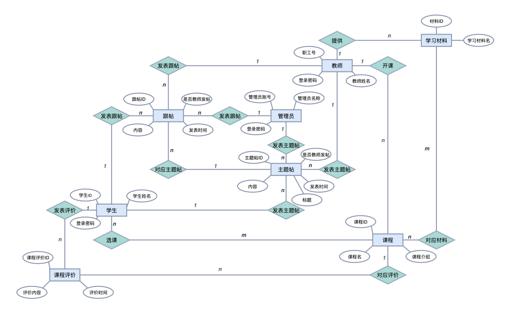

#  BUAA DB

2021年秋北航数据库大作业


## Description [](https://vuejs.org/)   [](https://www.djangoproject.com/)  [](https://element.eleme.io/)

FreeTalk课程平台，实现了学生选、退课，查看课程信息，课程评论，论坛讨论；教师开始、关闭、修改课程，添加、删除学习资料，关联课程和学习资料，发布通知；管理员统筹所有信息等功能。

### build and run：

```shell
$ cd spoc
$ python manage.py runserver
```

## Task List

Vue架构、前后端接口 (tqj)

Vue样式 (oyk)

<details>
<summary>Django后端、MySQL (gmm)</summary>

<br/>

- [x]  公用数据库
- [x]  转移models至pymysql

</br>
</details>

## DataBase

```
'HOST': 'rm-2zeu3f7e1n5yt10v0co.mysql.rds.aliyuncs.com',
'NAME': 'spoc',
'USER': 'root',
'PASSWORD': 'myja&*$4X579cKr',
'PORT': '3306'
```

## DataBase Design

### Final Design

**Entity：**

|                      Entity                      | Key  | Description |
| :----------------------------------------------: | :--: | :---------: |
|          `student(id, password, name)`           | `id` |  学生信息   |
|          `teacher(id, password, name)`           | `id` |  教师信息   |
|               `material(id, name)`               | `id` |  学习材料   |
|         `course(id, name, introduction)`         | `id` |  课程信息   |
|           `comment(id, content, time)`           | `id` |    评论     |
| `posttheme(id, title, content, time, isTeacher)` | `id` |   主题帖    |
|       `post(id, content, time, isTeacher)`       | `id` |    跟帖     |
|           `admin(id, password, name)`            | `id` |   管理员    |

**Relation：**

|                   Relation                    |    Key    |   Description    |
| :-------------------------------------------: | :-------: | :--------------: |
|    `student_course(student_id, course_id)`    | `all-key` |     学生选课     |
|    `teacher_course(teacher_id, course_id)`    | `all-key` |     教师开课     |
|  `teacher_material(teacher_id, material_id)`  | `all-key` |   教师提供学习材料   |
|   `course_material(course_id, material_id)`   | `all-key` |   课程对应学习材料   |
|   `student_comment(student_id, comment_id)`   | `all-key` |   学生发表评论   |
| `student_posttheme(student_id, posttheme_id)` | `all-key` |  学生发表主题帖  |
|      `student_post(student_id, post_id)`      | `all-key` |     学生跟帖     |
|    `course_comment(course_id, comment_id)`    | `all-key` |   课程对应评价   |
|    `post_posttheme(post_id, posttheme_id)`    | `all-key` |  跟帖对应主题帖  |
|   `admin_posttheme(admin_id, posttheme_id)`   | `all-key` | 管理员发表主题帖 |
|        `admin_post(admin_id, post_id)`        | `all-key` |    管理员跟帖    |
| `teacher_posttheme(teacher_id, posttheme_id)` | `all-key` |  教师发表主题帖  |
|      `teacher_post(teacher_id, post_id)`      | `all-key` |     教师跟帖     |

### E-R Diagram




full img: [e-r](./img/1211_er_full.svg), [db](./img/1211_db.svg)

### Plan Design

```
Entity

teacher(id, name, password, sex, department, telephone, email)
student(id, name, password, sex, department, orientation)
admin(id, password, telephone, email)
course(id, name, department, volume, credit)
material(id, name, department, obtain)
group(id, orientation, department, volume)

Relation 

courseEvaluation(id, content)
courseSelection(student_id, course_id)
groupJoin(student_id, group_id)
studentMaterialObtain(student_id, material_id)
groupMaterialObtain(group_id, material_id)
courseCreate(course_id, teacher_id, time)
groupTutor(course_id, teacher_id) //no time
grade() //打分
```

## Team

[@fangzhou0216][tqj], [@Mike-Smith-rem][oyk], [@imingx][gmm].

## License

[MIT](./LICENSE)


[tqj]: https://github.com/fangzhou0216
[oyk]: https://github.com/Mike-Smith-rem
[gmm]: https://github.com/imingx
