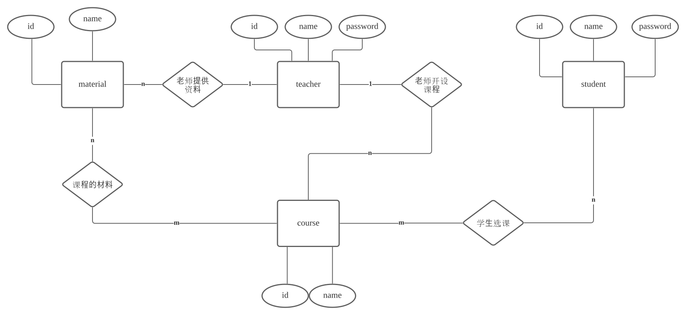

# BUAA DB

2021年北航数据库大作业


## Description 
 [](https://vuejs.org/)   [](https://www.djangoproject.com/) 

### build and run：

```shell
$ cd spoc
$ python manage.py runserver
```

## Task List

Vue架构、前后端接口 (tqj)

Vue样式 (oyk)

<details>
<summary>Django后端、MySQL (gmm)</summary>

<br/>

- [x]  公用数据库
- [x]  转移models至pymysql

</br>
</details>

## DataBase

```
'HOST': 'rm-2zeu3f7e1n5yt10v0co.mysql.rds.aliyuncs.com',
'NAME': 'spoc',
'USER': 'root',
'PASSWORD': 'myja&*$4X579cKr',
'PORT': '3306'
```

## DataBase Design

### Final Design

**实体：**

|            Entity             | Key  | Description |
| :---------------------------: | :--: | :---------: |
| `student(id, password, name)` | `id` |  学生信息   |
| `teacher(id, password, name)` | `id` |  教师信息   |
|     `material(id, name)`      | `id` |  学习材料   |
|      `course(id, name)`       | `id` |  课程信息   |

**关系：**

|                  Relation                   |    Key    |  Description   |
| :-----------------------------------------: | :-------: | :------------: |
|   `student_course(student_id, course_id)`   | `all-key` |  学生选课信息  |
|   `teacher_course(teacher_id, course_id)`   | `all-key` |  教师开课信息  |
| `teacher_material(teacher_id, material_id)` | `all-key` | 教师提供的材料 |
|  `course_material(course_id, material_id)`  | `all-key` |   课程的材料   |

### E-R Diagram




### Plan Design

```
Entity

teacher(id, name, password, sex, department, telephone, email)
student(id, name, password, sex, department, orientation)
admin(id, password, telephone, email)
course(id, name, department, volume, credit)
material(id, name, department, obtain)
group(id, orientation, department, volume)

Relation

courseEvaluation(id, content) //匿名?
courseSelection(student_id, course_id)
groupJoin(student_id, group_id)
studentMaterialObtain(student_id, material_id)
groupMaterialObtain(group_id, material_id)
courseCreate(course_id, teacher_id, time)
groupTutor(course_id, teacher_id) //no time
grade() //打分
```

## Team

[@fangzhou0216][tqj], [@Mike-Smith-rem][oyk], [@imingx][gmm].

## License


[tqj]: https://github.com/fangzhou0216
[oyk]: https://github.com/Mike-Smith-rem
[gmm]: https://github.com/imingx